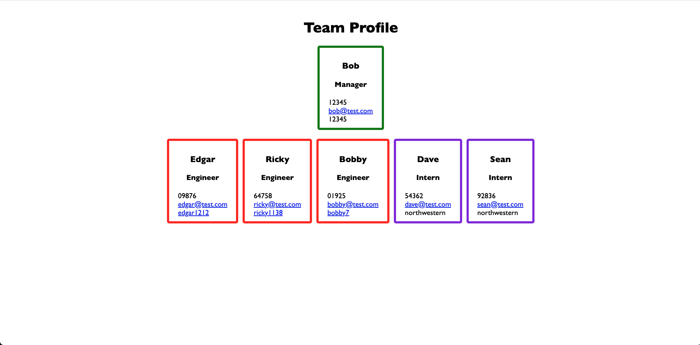

# Team-Profile-Generator

OOP Challenge 10: Team Profile Generator

- disclaimer: team.html is not provided so the grader can create a new file within the application

## User Story

```md
AS A bootcamp student
I WANT to generate a webpage that displays a team's basic info
SO THAT I or anyone can have quick access to their emails and GitHub profiles
```

## Acceptance Criteria

```md
GIVEN a command-line application that accepts user input

WHEN I am prompted for team members and their information
THEN an HTML file is generated displaying a formatted team roster based on user input

WHEN I click on an email address in the HTML
THEN my default email program opens and populates the TO field of the email with the address

WHEN I click on the GitHub username
THEN that GitHub profile opens in a new tab

WHEN I start the application
THEN I am prompted to enter the team manager’s name, employee ID, email address, and office number

WHEN I enter the Managers information
THEN I am presented with a menu with the option to add an engineer or an intern or to finish building the team

WHEN I select the engineer option
THEN I am prompted to enter the engineer’s name, ID, email, and GitHub username, and I am taken back to the menu options

WHEN I select the intern option
THEN I am prompted to enter the intern’s name, ID, email, and school, and I am taken back to the menu options

WHEN I decide to finish building my team
THEN I exit the application, and the HTML is generated

WHEN I run my tests in the terminal
THEN I should see all passing
```

## Mock-Up

The following image shows a mock-up of the generated HTML’s appearance and functionality:



## Links

The following are links to my repo and two videos (command line app & running tests)

### Repo:

https://github.com/edgarmartinez1212/Team-Profile-Generator

### Videos

Running command line: https://watch.screencastify.com/v/LqkOAUsduIMYP08DQs75
Tests: https://watch.screencastify.com/v/AUNCfoF4KRpaK9s8GTFp
